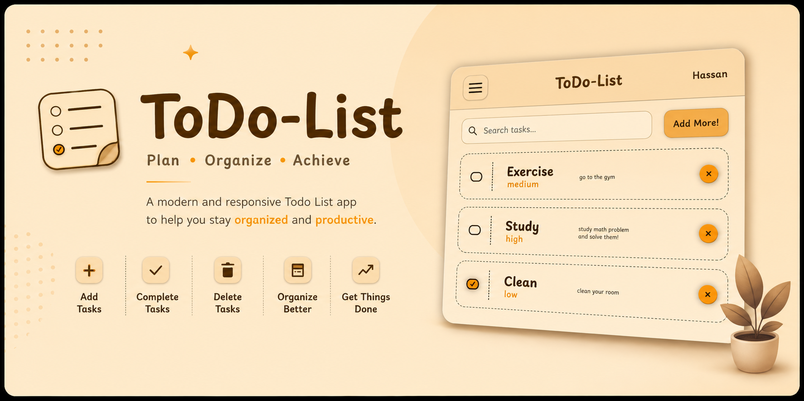
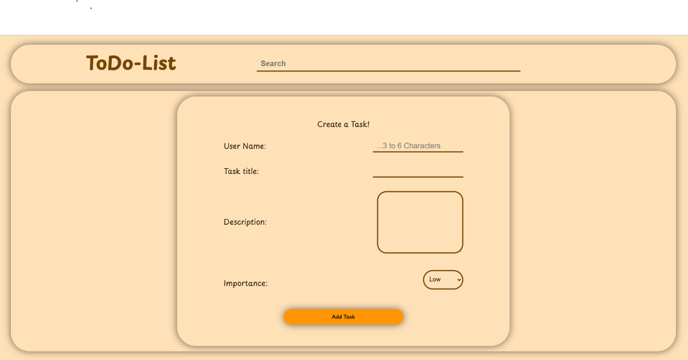
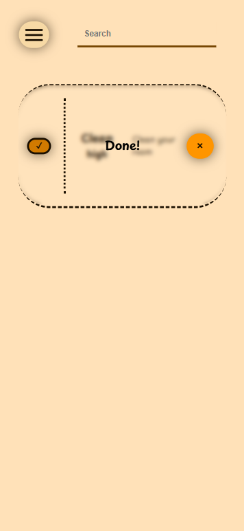

<p align="center">
  
</p>

<h1 align="center">
✅ Todo List
</h1>

<p align="center">


</p>

<p align="center">

A modern and responsive <b>React Todo List</b> application with an elegant UI, animated interactions, and reusable components.

</p>

## 🌐 Live Demo

🚀 **Live Website:** https://todo-list-xi-nine-59.vercel.app/

## 📂 Repository

💻 **GitHub:** https://github.com/Hassan-src/Todo-list

---

# ✨ Features

- ✅ Create new tasks
- 🗑️ Delete tasks
- ✔️ Mark tasks as completed
- 📋 Dynamic task rendering
- 📱 Fully responsive design
- 🍔 Animated hamburger menu
- 🪟 Task creation modal
- 🎨 Custom designed checkbox
- 💡 Smooth UI animations
- ⚛️ Built with reusable React components

---

# 🛠️ Built With

<p align="center">
  
</p>

<p align="center">
  React • JavaScript (ES6+) • HTML5 • CSS3
</p>

---

# 📸 Screenshots

## Desktop

<p align="center">
  
</p>

## Mobile

<p align="center">
  
</p>

---

# 🚀 Installation

Clone the repository

```bash
git clone https://github.com/Hassan-src/Todo-list.git
```

Go to the project directory

```bash
cd Todo-list
```

Install dependencies

```bash
npm install
```

Run the development server

```bash
npm run dev
```

Build for production

```bash
npm run build
```

---

# 🏗️ Project Architecture

```
App
│
├── TaskListNav
├── TaskList
│   ├── TaskListContent
│   ├── TaskCreatorStarter
│   └── TaskCreatorModal
│
└── Button
```

---

# 📂 Folder Structure

```
Todo-list
│
├── docs
│   └── images
│       ├── desktop.png
│       └── mobile.png
│
├── public
│
├── src
│   │
│   ├── components
│   │   ├── App.js
│   │   ├── Button.js
│   │   ├── TaskCreatorModal.js
│   │   ├── TaskCreatorStarter.js
│   │   ├── TaskList.js
│   │   ├── TaskListContent.js
│   │   └── TaskListNav.js
│   │
│   ├── styles
│   │   ├── App.css
│   │   ├── global.css
│   │   ├── navbar.css
│   │   ├── responsive.css
│   │   ├── scrollbar.css
│   │   ├── TaskCreatorModal.css
│   │   ├── TaskCreatorStarter.css
│   │   ├── TaskList.css
│   │   ├── TaskListContent.css
│   │   └── variables.css
│   │
│   └── index.js
│
├── package.json
├── package-lock.json
├── README.md
└── .gitignore
```

---

# 💡 What I Learned

This project helped me practice and improve my knowledge of:

- React Components
- Props
- State Management with `useState`
- Conditional Rendering
- Rendering Lists with `map()`
- Updating State Immutably
- CSS Flexbox
- CSS Grid
- Responsive Design
- Custom Form Elements
- CSS Animations
- Component Organization

---

# 🔮 Future Improvements

- 🔍 Task Search
- ✏️ Edit Tasks
- 📌 Task Categories
- ⭐ Priority Filtering
- 💾 Local Storage
- 🌙 Dark Mode
- 📅 Due Dates
- 🔔 Notifications
- 📊 Task Statistics

---

# 🤝 Contributing

Contributions, issues, and feature requests are welcome.

Feel free to fork the project and submit a pull request.

---

# 👨‍💻 Author

### Hassan Esmaeilpour

GitHub:
https://github.com/Hassan-src

LinkedIn:
https://www.linkedin.com/in/hassansrc/

---

# ⭐ Support

If you like this project, consider giving it a ⭐ on GitHub.

It helps others discover the project and motivates future improvements.
